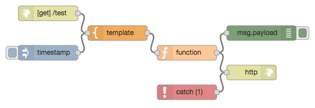
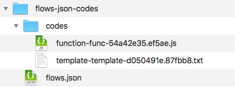

# Separate Flow-JSON (for Node-RED)

## Released

|Date|Version|Description|
|:--:|:--:|:--|
|2017-10-25|0.1.4|Update documents.|
|2017-10-24|0.0.1|Released.|


## Feature

- Node For Node-RED.
- Separate Flow-JSON's `function` and `template`.
- function to `js`, template to `txt`.
- May be able to see the diff.

## Install

```bash
npm install --save node-red-contrib-separate-flow-json
```


## Example Flow

- Split at deployment.


```json
[
    {
        "id": "4798cabe.0a24f4",
        "type": "separate-flow-json",
        "z": "7f800dfb.bd3784",
        "name": "",
        "target": "payload",
        "x": 330,
        "y": 120,
        "wires": [
            [
                "d62b25e4.927658"
            ]
        ]
    },
    {
        "id": "cc4040a9.41e29",
        "type": "inject",
        "z": "7f800dfb.bd3784",
        "name": "inject",
        "topic": "",
        "payload": "Separate Flow JSON",
        "payloadType": "str",
        "repeat": "",
        "crontab": "",
        "once": true,
        "x": 150,
        "y": 120,
        "wires": [
            [
                "4798cabe.0a24f4"
            ]
        ]
    },
    {
        "id": "d62b25e4.927658",
        "type": "debug",
        "z": "7f800dfb.bd3784",
        "name": "",
        "active": true,
        "console": "false",
        "complete": "false",
        "x": 530,
        "y": 120,
        "wires": []
    }
]
```

## Separate Files





- function-func-54a42e35.ef5ae.js
  - `func key of function node` file

```js
var items = msg.payload.items.filter(function(item){
  return (item > 20);
});
msg.payload = items;
return msg;
```

- template-template-d050491e.87fbb8.txt
  - `template key of template node` file

```txt
{
  "payload": "{{{payload}}}",
  "topic": "hoge",
  "timestamp": 1508256583,
  "items": [
    10,
    20,
    30,
    40,
    50
  ]
}
```

- flow.json
  - without `func key of function node` and `template key of template node`. 

```json
[
    {
        "id": "54a42e35.ef5ae",
        "type": "function",
        "z": "7f800dfb.bd3784",
        "name": "function",
        "func": "",
        "outputs": 1,
        "noerr": 0,
        "x": 480,
        "y": 180,
        "wires": [
            [
                "730a967a.429368",
                "57400b67.6c9ab4"
            ]
        ]
    },
    {
        "id": "d050491e.87fbb8",
        "type": "template",
        "z": "7f800dfb.bd3784",
        "name": "template",
        "field": "payload",
        "fieldType": "msg",
        "format": "json",
        "syntax": "mustache",
        "template": "",
        "output": "json",
        "x": 340,
        "y": 140,
        "wires": [
            [
                "54a42e35.ef5ae"
            ]
        ]
    },
    {
        "id": "7f4e5007.5719",
        "type": "http in",
        "z": "7f800dfb.bd3784",
        "name": "",
        "url": "/test",
        "method": "get",
        "upload": false,
        "swaggerDoc": "",
        "x": 200,
        "y": 100,
        "wires": [
            [
                "d050491e.87fbb8"
            ]
        ]
    },
    {
        "id": "730a967a.429368",
        "type": "http response",
        "z": "7f800dfb.bd3784",
        "name": "",
        "statusCode": "",
        "headers": {},
        "x": 610,
        "y": 220,
        "wires": []
    },
    {
        "id": "186a421.c73e6be",
        "type": "catch",
        "z": "7f800dfb.bd3784",
        "name": "",
        "scope": [
            "54a42e35.ef5ae"
        ],
        "x": 480,
        "y": 260,
        "wires": [
            [
                "730a967a.429368"
            ]
        ]
    },
    {
        "id": "57400b67.6c9ab4",
        "type": "debug",
        "z": "7f800dfb.bd3784",
        "name": "",
        "active": true,
        "console": "false",
        "complete": "false",
        "x": 630,
        "y": 140,
        "wires": []
    },
    {
        "id": "7b8fb706.e9afd8",
        "type": "inject",
        "z": "7f800dfb.bd3784",
        "name": "",
        "topic": "",
        "payload": "",
        "payloadType": "date",
        "repeat": "",
        "crontab": "",
        "once": false,
        "x": 200,
        "y": 180,
        "wires": [
            [
                "d050491e.87fbb8"
            ]
        ]
    }
]
```


## Environment

* Node-RED

